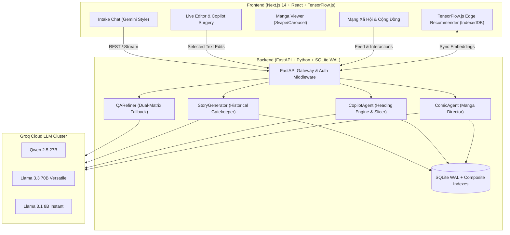

# NarrAI

NarrAI là nền tảng đồng sáng tác văn học và mạng xã hội dành cho tác giả, độc giả và người sáng tạo truyện tranh. Nền tảng hỗ trợ phát triển ý tưởng, viết và biên tập bản thảo, chuyển thể thành truyện tranh, sau đó chia sẻ tác phẩm với cộng đồng.

## Thông tin dự án

- Đội thi: Những ngôi sao mộng mơ
- Đơn vị: Trường Quốc tế, Đại học Quốc gia Hà Nội (VNU-IS)
- Cuộc thi: iStartup 2026

## Tính năng

### 1. Quy trình sáng tác có AI hỗ trợ
- **Agent 1 — Q&A Intake Refiner (`qa_refiner.py`)**: 
  - Khung chat phỏng vấn ý tưởng tự nhiên phong cách Gemini/ChatGPT.
  - Dual-Matrix Fallback: chuyển model hoặc API key khi gặp lỗi hay giới hạn dịch vụ.
  - Concept Mirroring: phản hồi dựa trên chi tiết trong ý tưởng và đặt câu hỏi làm rõ.
- **Agent 2 — Story Generator (`story_generator.py`)**:
  - Hỗ trợ dàn ý và viết truyện theo năm nhịp: Hook, Rising Friction, Turning Point, Visceral Climax và Cliffhanger.
  - Hỗ trợ đa dạng thể loại: Lịch sử/Dã sử, Kỳ ảo/Tu chân, Đô thị/Chữa lành, Sci-Fi/Cyberpunk, Trinh thám/Giật gân.
- **Agent 3 — Copilot Flexible Surgery (`copilot_agent.py`)**:
  - Biên tập bản thảo theo thời gian thực (Live Editor).
  - Chỉnh sửa đoạn văn được chọn mà không thay đổi phần còn lại của bản thảo.
  - Giữ các tiêu đề chương khi biên tập nội dung nhiều chương.
- **Agent 4 — Comic Director (`comic_agent.py`)**:
  - Chuyển bản thảo thành kịch bản truyện tranh gồm khung hình, lời thoại và prompt tạo ảnh.
  - Duy trì thông tin nhân vật và bối cảnh giữa các khung. Ảnh có thể tải lại khi gặp lỗi; trang đầu được ưu tiên tải trước.
  - Giao diện đọc giữ phần điều khiển ngoài khung tranh, không phủ thêm thành phần giao diện ứng dụng lên ảnh truyện.

### 2. Kiểm tra nội dung lịch sử và nhận diện IP
- Bộ quy tắc lịch sử bao gồm các nhân vật và sự kiện Việt Nam qua nhiều giai đoạn.
- Bộ kiểm tra phát hiện một số dạng xuyên tạc kết quả trận chiến và hình tượng nhân vật lịch sử, kể cả cách viết tiếng Việt không dấu.
- Ba chế độ sáng tác:
  - *Chính sử*: Ưu tiên tuân thủ các sự kiện và nhân vật lịch sử.
  - *Dã sử*: Cho phép nhân vật hư cấu trong bối cảnh lịch sử.
  - *Hư cấu tự do*: Không áp dụng các ràng buộc lịch sử.
- Nhận diện một số thương hiệu có bản quyền và hiển thị thông tin tác phẩm phái sinh khi xuất bản.

### 3. Cộng đồng sáng tác
- Bảng tin đề xuất và bảng tin tác giả đang theo dõi.
- Tìm kiếm nội dung, lọc theo thể loại, phân trang tải thêm và đề xuất tác phẩm.
- Theo dõi tác giả, thích và chia sẻ bài viết; liên kết chia sẻ mở được tác phẩm tương ứng.
- Bình luận theo luồng, tủ sách cá nhân, bảng xếp hạng và xu hướng.
- Nhắn tin nội bộ, xuất bản thảo `.txt`, `.md` hoặc `.pdf`, và đọc truyện chữ hoặc truyện tranh.
- Số dư Xu được lưu trên máy chủ; tính năng nạp Xu hiện ở chế độ demo MVP, cộng Xu trực tiếp và chưa xử lý thanh toán ngân hàng.

### 4. Khả năng phục hồi khi sinh nội dung
- Luồng sinh truyện có thể tiếp tục khi nhà cung cấp dừng do giới hạn độ dài.
- Bản thảo đã nhận được lưu lại khi quá trình sinh bị gián đoạn, để tác giả có thể khôi phục nội dung chưa hoàn chỉnh.
- Giao diện thông báo rõ khi bản nháp chưa hoàn tất.

### 5. Hạ tầng
- TensorFlow.js hỗ trợ cá nhân hóa bảng tin phía trình duyệt và lưu dữ liệu đệm trong IndexedDB.
- Backend sử dụng SQLite WAL và GZip middleware.

---

## Kiến trúc hệ thống



---

## Cấu trúc thư mục

```
NarrAI/
├── backend/
│   ├── agents/
│   │   ├── qa_refiner.py           # Agent 1: Phỏng vấn ý tưởng, Dual-Matrix Fallback
│   │   ├── story_generator.py      # Agent 2: Sinh bản thảo, bảo vệ lịch sử 31 anh hùng
│   │   ├── copilot_agent.py        # Agent 3: Copilot phẫu thuật bản thảo, giữ tiêu đề
│   │   └── comic_agent.py          # Agent 4: Chuyển thể kịch bản truyện tranh Manga
│   ├── db/
│   │   ├── database.py             # Cấu hình SQLite WAL mode & Session Factory
│   │   └── models.py               # Database Schema (Stories, Social, Comments, Follows...)
│   ├── llm/
│   │   └── groq_client.py          # Groq LLM Wrapper, quản lý token budget & retry
│   ├── routers/
│   │   ├── social_router.py        # API Mạng xã hội, Bình luận phân cấp, Follow, Bookmark
│   │   ├── messenger_router.py     # API Trò chuyện nội bộ
│   │   └── export_router.py        # API Xuất bản thảo (.txt, .md, .pdf)
│   ├── services/
│   │   ├── banking_service.py      # Hệ thống tiền tệ Xu (Coin economy)
│   │   ├── cache_service.py        # Cache quản lý phiên làm việc
│   │   └── recommender_service.py  # Dịch vụ xuất vector nhúng cho TF.js
│   ├── tests/
│   │   ├── run_all_tests.py        # Bộ kiểm thử tích hợp
│   │   ├── test_round7_qa_resilience.py # Kiểm thử độ bền AI và fallback
│   │   ├── test_round6_social_features.py
│   │   ├── test_round6_historical_protection.py
│   │   └── ... (Bộ test suites toàn diện)
│   ├── main.py                     # Entrypoint FastAPI Server
│   └── requirements.txt            # Danh sách thư viện Python
│
├── frontend/
│   ├── src/
│   │   ├── app/
│   │   │   ├── layout.tsx          # Root Layout & Theme Provider
│   │   │   └── page.tsx            # Trang chính điều phối View (Landing / Workspace)
│   │   ├── components/
│   │   │   ├── setup/
│   │   │   │   └── UnifiedIntakeChat.tsx # Giao diện phỏng vấn AI (căn giữa đối xứng)
│   │   │   ├── editor/
│   │   │   │   └── LiveEditor.tsx        # Trình soạn thảo văn bản thời gian thực
│   │   │   ├── comic/
│   │   │   │   └── ComicWorkspace.tsx    # Xưởng kịch bản Manga & Visualizer
│   │   │   ├── social/
│   │   │   │   └── CommunityFeedView.tsx # Bảng tin Mạng xã hội, Threaded Comments
│   │   │   ├── landing/
│   │   │   │   └── LandingView.tsx       # Trang chủ giới thiệu, sạch sẽ tối giản
│   │   │   └── layout/
│   │   │       ├── Sidebar.tsx           # Thanh điều hướng công thái học
│   │   │       └── Header.tsx            # Header hiển thị số dư Xu, Ngôn ngữ, Theme
│   │   ├── services/
│   │   │   ├── tfjsRecommender.ts  # Mô hình gợi ý TensorFlow.js trên client
│   │   │   └── indexedDBCache.ts   # Quản lý bộ nhớ đệm IndexedDB client-side
│   │   └── lib/
│   │       ├── api.ts              # API Client kết nối Backend (hỗ trợ retry)
│   │       ├── i18n.ts             # Song ngữ Việt - Anh hoàn chỉnh
│   │       └── types.ts            # Khai báo TypeScript types toàn hệ thống
│   ├── package.json
│   ├── tailwind.config.ts
│   └── tsconfig.json
│
├── PROJECT.md
├── PRODUCT.md
└── README.md
```

---

## Cài đặt và chạy ứng dụng

### Yêu cầu
- **Python**: 3.10 trở lên (khuyên dùng Python 3.11 hoặc 3.12)
- **Node.js**: 18.x trở lên & **npm** / **pnpm**
- **Groq API Keys**: Đăng ký miễn phí tại [Groq Console](https://console.groq.com)

---

### Cài đặt backend

```bash
# 1. Di chuyển vào thư mục backend
cd backend

# 2. Tạo môi trường ảo (khuyến nghị)
python -m venv venv

# Kích hoạt trên Windows:
.\venv\Scripts\activate
# Hoặc trên macOS/Linux:
source venv/bin/activate

# 3. Cài đặt các thư viện phụ thuộc
pip install -r requirements.txt

# 4. Cấu hình biến môi trường
cp .env.example .env
```

#### Cấu hình `backend/.env`
```env
# Groq API Keys (có thể dùng chung 1 key hoặc chia tách để tối ưu rate limit)
GROQ_API_KEY=gsk_your_groq_api_key_here
GROQ_API_KEY_BIBLE=gsk_your_groq_api_key_here
GROQ_API_KEY_COPILOT=gsk_your_groq_api_key_here
GROQ_API_KEY_COMIC=gsk_your_groq_api_key_here

# JWT Secret Key (Thay bằng chuỗi ngẫu nhiên an toàn trong Production)
JWT_SECRET=your_super_secret_jwt_key_change_in_production

# Tài khoản được phép xem và xử lý báo cáo kiểm duyệt (phân tách bằng dấu phẩy)
NARRAI_MODERATOR_USERNAMES=

# Database (mặc định SQLite WAL mode)
DATABASE_URL=sqlite:///./narrai.db
```

#### Khởi chạy backend
```bash
python main.py
```
> Máy chủ FastAPI sẽ khởi chạy tại: `http://localhost:8000`  
> Tài liệu Swagger UI tương tác: `http://localhost:8000/docs`

---

### Cài đặt frontend

Mở một cửa sổ Terminal mới:

```bash
# 1. Di chuyển vào thư mục frontend
cd frontend

# 2. Cài đặt các gói npm phụ thuộc
npm install

# 3. (Tùy chọn) Cấu hình URL backend trong .env.local
# Nếu chạy local:
echo "NEXT_PUBLIC_API_URL=http://localhost:8000/api" > .env.local

# 4. Khởi chạy máy chủ phát triển
npm run dev
```
> Mở trình duyệt và truy cập: `http://localhost:3000`

---

## Kiểm thử

```bash
# Chạy các bộ kiểm thử tích hợp backend
cd backend
python tests/run_all_tests.py
```

Các bộ hồi quy liên quan đến thay đổi gần đây có thể chạy riêng:

```bash
cd backend
python -m unittest tests.test_adversarial_m2_historical_invariants tests.test_round6_historical_copyright tests.test_e2e_ontology_modes
python -m unittest discover -s tests -p "test_comic*.py"
python -m unittest discover -s tests -p "test_groq_client_stream_resume.py"
```

Kiểm tra frontend bằng `npm run build` trong thư mục `frontend`. Kết quả kiểm thử local không đồng nghĩa với việc phiên bản production đã được cập nhật.

---

## Triển khai

### Backend trên Render
- Tạo mới **Web Service** trên [Render](https://render.com).
- Build Command: `pip install -r backend/requirements.txt`
- Start Command: `cd backend && python main.py`
- Cấu hình các biến môi trường `GROQ_API_KEY`, `JWT_SECRET` trên Render Dashboard.

### Frontend trên Vercel
- Nhập dự án từ GitHub lên [Vercel](https://vercel.com).
- Root Directory: `frontend`
- Build Command: `npm run build`
- Output Directory: Để trống / mặc định (Vercel tự động nhận diện và phục vụ từ `.next`)
- Environment Variables: `NEXT_PUBLIC_API_URL=https://<your-render-url>/api`

---

## Nhóm dự án và bản quyền

Dự án được phát triển với tinh thần cống hiến cho văn hóa đọc và cộng đồng sáng tác văn học Việt Nam.

- **Đội thi**: Những ngôi sao mộng mơ
- **Đại diện**: Khoa Kinh tế & Quản lý / Công nghệ thông tin - Trường Quốc tế (VNU-IS)
- **Bản quyền**: © 2026 NarrAI Team. Bảo lưu mọi quyền trong khuôn khổ Cuộc thi iStartup 2026.
