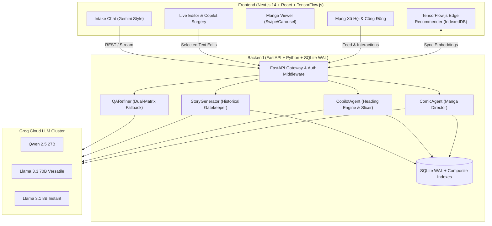

# NarrAI — Nền Tảng Đồng Sáng Tác Văn Học & Mạng Xã Hội Truyện AI Thế Hệ Mới

<p align="center">
  <strong>Hệ sinh thái AI hỗ trợ tác giả chấp bút tiểu thuyết, kịch bản & truyện tranh Manga, tích hợp bảo vệ lịch sử dân tộc và mạng xã hội văn học tương tác cao.</strong>
</p>

<p align="center">
  
  
  
  
  
  
</p>

---

## 📖 Giới Thiệu Tổng Quan

**NarrAI** là nền tảng đồng sáng tác văn học và mạng xã hội thế hệ mới, giải quyết trọn vẹn rào cản cạn kiệt ý tưởng và viết lách của tác giả trẻ thông qua đội ngũ **Multi-Agent AI chuyên sâu**. NarrAI kết hợp mô hình ngôn ngữ lớn (LLM) với thuật toán đề xuất **TensorFlow.js Hybrid (Edge AI)** chạy trực tiếp trên trình duyệt, đồng thời tiên phong thiết lập hệ thống **bảo vệ lịch sử dân tộc Việt Nam** và bản quyền sở hữu trí tuệ (IP).

### 🏆 Đội thi & Dự án
- **Đội thi**: Những ngôi sao mộng mơ
- **Đơn vị**: Trường Quốc tế - Đại học Quốc gia Hà Nội (VNU-IS)
- **Cuộc thi**: Cuộc thi Khởi nghiệp Đổi mới Sáng tạo **iStartup 2026**

---

## ✨ Tính Năng Nổi Bật (Key Features)

### 1. 🤖 Đội Ngũ Multi-Agent Phối Hợp Nhịp Nhàng
- **Agent 1 — Q&A Intake Refiner (`qa_refiner.py`)**: 
  - Khung chat phỏng vấn ý tưởng tự nhiên phong cách Gemini/ChatGPT.
  - **Dual-Matrix Fallback (Ma trận dự phòng kép)**: Luân chuyển tự động 3 mô hình (`Qwen 2.5 27B` ➔ `Llama-3.3-70B` ➔ `Llama-3.1-8B`) qua 3 Groq API keys, đảm bảo uptime 99.9%.
  - **Concept Mirroring Prompt**: Triệt tiêu văn mẫu sáo rỗng, bắt buộc bóc tách từ khóa cụ thể của tác giả và hỏi ngược gợi mở 1-2 câu sâu sắc.
- **Agent 2 — Story Generator (`story_generator.py`)**:
  - Chấp bút tiểu thuyết theo **Cấu trúc 5 Nhịp Kịch Tính (5 Dramatic Narrative Beats)**: Hook ➔ Rising Friction ➔ Turning Point ➔ Visceral Climax ➔ Cliffhanger.
  - Hỗ trợ đa dạng thể loại: Lịch sử/Dã sử, Kỳ ảo/Tu chân, Đô thị/Chữa lành, Sci-Fi/Cyberpunk, Trinh thám/Giật gân.
- **Agent 3 — Copilot Flexible Surgery (`copilot_agent.py`)**:
  - Biên tập bản thảo theo thời gian thực (Live Editor).
  - **Phẫu thuật đoạn văn bôi đen (`selectedText`)**: Chỉ sửa chính xác vùng tác giả yêu cầu, không thay đổi phần còn lại.
  - **HeadingPreservationEngine**: Bảo toàn tuyệt đối thứ tự và vị trí các mốc chương (`## Chương X`) khi biên tập nhiều chương.
- **Agent 4 — Comic Director (`comic_agent.py`)**:
  - Phân tích bản thảo và tự động chuyển thể thành kịch bản truyện tranh Manga gồm các khung hình (Panels), lời thoại và prompt sinh ảnh chuyên nghiệp.

### 2. 🇻🇳 Hệ Thống Bảo Vệ Lịch Sử Dân Tộc & Bản Quyền IP
- **Bảo hộ 31 Anh hùng Dân tộc**: Ngô Quyền, Hai Bà Trưng, Lý Thường Kiệt, Trần Hưng Đạo, Lê Lợi, Nguyễn Huệ - Quang Trung, Hồ Chí Minh, Võ Nguyên Giáp...
- **AI Semantic Classifier**: Ngăn chặn hành vi xuyên tạc chiến công hoặc đảo ngược niên đại lịch sử dân tộc ngay cả khi người dùng dùng từ lách luật.
- **3 Chế độ sáng tác tự động nhận diện (Auto-detect)**:
  - *Chính sử*: Bảo toàn 100% sự kiện và nhân vật lịch sử.
  - *Dã sử*: Cho phép sáng tạo nhân vật hư cấu trong bối cảnh lịch sử chân thực.
  - *Hư cấu tự do*: Giải phóng tối đa trí tưởng tượng cho các thể loại hiện đại/kỳ ảo.
- **Bảo hộ bản quyền IP**: Tự động nhận diện thương hiệu bản quyền thương mại và gắn nhãn disclaimer cho tác phẩm phái sinh (fanfiction).

### 3. 🌐 Mạng Xã Hội Văn Học Tương Tác Cao (Social Feed)
- **Bảng tin cộng đồng (Community Feed)**: Khám phá, lọc theo thể loại và tìm kiếm tác phẩm.
- **Theo dõi tác giả (Follow / Unfollow)**: Ưu tiên bảng tin từ các tác giả yêu thích.
- **Bình luận phân cấp (Threaded Comments)**: Độc giả thảo luận, phản hồi lồng nhau và trích dẫn tác giả.
- **Tủ sách cá nhân (Bookmarks)**: Lưu trữ và phân loại truyện theo danh mục.
- **Hệ thống Xếp hạng (Leaderboard/Trending)**: Vinh danh các tác phẩm nổi bật theo tuần và tháng.
- **Trình đọc chuyên dụng**: Hỗ trợ chuyển đổi giữa Truyện chữ và Trình đọc Manga fullscreen với thao tác lật trang trực quan.

### 4. ⚡ Công Nghệ Tối Ưu & TensorFlow.js Hybrid
- **Client-Side Edge AI**: Khởi chạy mô hình nhúng cục bộ với TensorFlow.js, lưu cache IndexedDB (≤ 15MB) giúp cá nhân hóa bảng tin mà không tốn chi phí gọi backend.
- **Hiệu năng cơ sở dữ liệu**: SQLite cấu hình chuẩn **WAL Mode** (`PRAGMA journal_mode=WAL; PRAGMA synchronous=NORMAL;`), composite indexes tối ưu tốc độ truy vấn đa luồng.
- **Nén GZip Middleware**: Tối ưu băng thông cho toàn bộ API payload.

---

## 🏗 Kiến Trúc Hệ Thống (Architecture)



---

## 📂 Cấu Trúc Thư Mục (Directory Structure)

```
NarrAI/
├── backend/
│   ├── agents/
│   │   ├── qa_refiner.py           # Agent 1: Phỏng vấn ý tưởng, Dual-Matrix Fallback
│   │   ├── story_generator.py      # Agent 2: Sinh bản thảo, bảo vệ lịch sử 31 anh hùng
│   │   ├── copilot_agent.py        # Agent 3: Copilot phẫu thuật bản thảo, giữ tiêu đề
│   │   └── comic_agent.py          # Agent 4: Chuyển thể kịch bản truyện tranh Manga
│   ├── db/
│   │   ├── database.py             # Cấu hình SQLite WAL mode & Session Factory
│   │   └── models.py               # Database Schema (Stories, Social, Comments, Follows...)
│   ├── llm/
│   │   └── groq_client.py          # Groq LLM Wrapper, quản lý token budget & retry
│   ├── routers/
│   │   ├── social_router.py        # API Mạng xã hội, Bình luận phân cấp, Follow, Bookmark
│   │   ├── messenger_router.py     # API Trò chuyện nội bộ
│   │   └── export_router.py        # API Xuất bản thảo (.txt, .md, .pdf)
│   ├── services/
│   │   ├── banking_service.py      # Hệ thống tiền tệ Xu (Coin economy)
│   │   ├── cache_service.py        # Cache quản lý phiên làm việc
│   │   └── recommender_service.py  # Dịch vụ xuất vector nhúng cho TF.js
│   ├── tests/
│   │   ├── run_all_tests.py        # Test runner tự động (203 tests)
│   │   ├── test_round7_qa_resilience.py # 21 tests kiểm thử độ bền AI & Fallback
│   │   ├── test_round6_social_features.py
│   │   ├── test_round6_historical_protection.py
│   │   └── ... (Bộ test suites toàn diện)
│   ├── main.py                     # Entrypoint FastAPI Server
│   └── requirements.txt            # Danh sách thư viện Python
│
├── frontend/
│   ├── src/
│   │   ├── app/
│   │   │   ├── layout.tsx          # Root Layout & Theme Provider
│   │   │   └── page.tsx            # Trang chính điều phối View (Landing / Workspace)
│   │   ├── components/
│   │   │   ├── setup/
│   │   │   │   └── UnifiedIntakeChat.tsx # Giao diện phỏng vấn AI (căn giữa đối xứng)
│   │   │   ├── editor/
│   │   │   │   └── LiveEditor.tsx        # Trình soạn thảo văn bản thời gian thực
│   │   │   ├── comic/
│   │   │   │   └── ComicWorkspace.tsx    # Xưởng kịch bản Manga & Visualizer
│   │   │   ├── social/
│   │   │   │   └── CommunityFeedView.tsx # Bảng tin Mạng xã hội, Threaded Comments
│   │   │   ├── landing/
│   │   │   │   └── LandingView.tsx       # Trang chủ giới thiệu, sạch sẽ tối giản
│   │   │   └── layout/
│   │   │       ├── Sidebar.tsx           # Thanh điều hướng công thái học
│   │   │       └── Header.tsx            # Header hiển thị số dư Xu, Ngôn ngữ, Theme
│   │   ├── services/
│   │   │   ├── tfjsRecommender.ts  # Mô hình gợi ý TensorFlow.js trên client
│   │   │   └── indexedDBCache.ts   # Quản lý bộ nhớ đệm IndexedDB client-side
│   │   └── lib/
│   │       ├── api.ts              # API Client kết nối Backend (hỗ trợ retry)
│   │       ├── i18n.ts             # Song ngữ Việt - Anh hoàn chỉnh
│   │       └── types.ts            # Khai báo TypeScript types toàn hệ thống
│   ├── package.json
│   ├── tailwind.config.ts
│   └── tsconfig.json
│
└── README.md
```

---

## 🛠 Hướng Dẫn Cài Đặt & Khởi Chạy (Getting Started)

### Yêu Cầu Tiên Quyết (Prerequisites)
- **Python**: 3.10 trở lên (khuyên dùng Python 3.11 hoặc 3.12)
- **Node.js**: 18.x trở lên & **npm** / **pnpm**
- **Groq API Keys**: Đăng ký miễn phí tại [Groq Console](https://console.groq.com)

---

### 1. Cài Đặt Backend

```bash
# 1. Di chuyển vào thư mục backend
cd backend

# 2. Tạo môi trường ảo (khuyến nghị)
python -m venv venv

# Kích hoạt trên Windows:
.\venv\Scripts\activate
# Hoặc trên macOS/Linux:
source venv/bin/activate

# 3. Cài đặt các thư viện phụ thuộc
pip install -r requirements.txt

# 4. Cấu hình biến môi trường
cp .env.example .env
```

#### Cấu hình tệp `backend/.env`:
```env
# Groq API Keys (có thể dùng chung 1 key hoặc chia tách để tối ưu rate limit)
GROQ_API_KEY=gsk_your_groq_api_key_here
GROQ_API_KEY_BIBLE=gsk_your_groq_api_key_here
GROQ_API_KEY_COPILOT=gsk_your_groq_api_key_here
GROQ_API_KEY_COMIC=gsk_your_groq_api_key_here

# JWT Secret Key
JWT_SECRET=narrai-istartup2026-super-secret-jwt-key

# Database (mặc định SQLite WAL mode)
DATABASE_URL=sqlite:///./narrai.db
```

#### Khởi chạy máy chủ Backend:
```bash
python main.py
```
> Máy chủ FastAPI sẽ khởi chạy tại: `http://localhost:8000`  
> Tài liệu Swagger UI tương tác: `http://localhost:8000/docs`

---

### 2. Cài Đặt Frontend

Mở một cửa sổ Terminal mới:

```bash
# 1. Di chuyển vào thư mục frontend
cd frontend

# 2. Cài đặt các gói npm phụ thuộc
npm install

# 3. (Tùy chọn) Cấu hình URL backend trong .env.local
# Nếu chạy local:
echo "NEXT_PUBLIC_API_URL=http://localhost:8000/api" > .env.local

# 4. Khởi chạy máy chủ phát triển
npm run dev
```
> Mở trình duyệt và truy cập: `http://localhost:3000`

---

## 🧪 Kiểm Thử Hệ Thống (Automated Testing)

Toàn bộ hệ thống NarrAI được trang bị bộ kiểm thử tự động toàn diện từ unit test đến end-to-end integration:

```bash
# Chạy toàn bộ 203 bài kiểm tra backend
cd backend
python tests/run_all_tests.py
```

**Kết quả kiểm toán chất lượng:**
- **Core E2E Tests**: 111/111 PASS
- **Round 5 Integration Tests**: 71/71 PASS
- **Round 7 AI Resilience & Fallback Tests**: 21/21 PASS
- **Tổng cộng**: **203/203 tests PASS (100%)**
- **Frontend Type Check**: `npm run build` thành công, **0 lỗi TypeScript**.

---

## 🚀 Hướng Dẫn Triển Khai Thực Tế (Deployment)

### Backend (Render)
- Tạo mới **Web Service** trên [Render](https://render.com).
- Build Command: `pip install -r backend/requirements.txt`
- Start Command: `cd backend && python main.py` hoặc `uvicorn backend.main:app --host 0.0.0.0 --port $PORT`
- Cấu hình các biến môi trường `GROQ_API_KEY`, `JWT_SECRET` trên Render Dashboard.

### Frontend (Vercel)
- Nhập dự án từ GitHub lên [Vercel](https://vercel.com).
- Root Directory: `frontend`
- Build Command: `npm run build`
- Output Directory: `out` (nếu dùng static export) hoặc `.next`
- Environment Variables: `NEXT_PUBLIC_API_URL=https://<your-render-url>/api`

---

## 📜 Giấy Phép & Bản Quyền (License & Team)

Dự án được phát triển với tinh thần cống hiến cho văn hóa đọc và cộng đồng sáng tác văn học Việt Nam.

- **Đội thi**: Những ngôi sao mộng mơ
- **Đại diện**: Khoa Kinh tế & Quản lý / Công nghệ thông tin - Trường Quốc tế (VNU-IS)
- **Bản quyền**: © 2026 NarrAI Team. Bảo lưu mọi quyền trong khuôn khổ Cuộc thi iStartup 2026.
